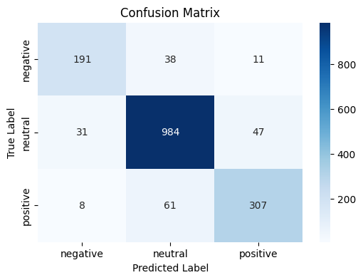

# ModernBERT – Financial Sentiment Analysis

ModernBERT is a lightweight, **encoder-only** transformer fine-tuned to classify *positive*, *neutral*, and *negative* sentiment in financial news and corporate statements.  It combines modern pre-training strategies with the proven BERT architecture to provide state-of-the-art accuracy while remaining inexpensive to train and serve.

The result is a drop-in replacement for BERT-base that is more data-efficient during fine-tuning and can be slightly faster at inference when using fused layer-norm and GELU implementations.

---

## Why ModernBERT?
1. **Bidirectional context** – BERT’s self-attention reads text left-to-right *and* right-to-left, crucial for nuanced finance language (e.g., “*not expected to decline*”).
2. **No decoder overhead** – Encoder-only models skip autoregressive decoding, reducing memory usage and latency compared with encoder–decoder alternatives.
3. **Domain adaptability** – Modern pre-training and continued fine-tuning on finance corpora give strong coverage of tickers, abbreviations, and numeric patterns.
4. **Compact** – ≈110 M parameters fits comfortably on a single GPU/CPU for inference.

---

## Project Motivation
Retail and institutional investors need fast, reliable sentiment signals from breaking news.  Traditional rule-based approaches miss context, while heavyweight LLMs are too costly for real-time pipelines.  The goal is to validate that a compact transformer can reach production-grade accuracy on noisy, real-world finance text.

---

## Features
- End-to-end notebook for data prep, training, and evaluation
- Hugging Face 🤗 `transformers` + `datasets` integration
- Experiment tracking with Weights & Biases (wandb)
- Ready-to-deploy PyTorch checkpoint and tokenizer

---

### Configuration
Set the following environment variables (or edit the notebook cells):
- `WANDB_API_KEY` – your Weights & Biases key
- `HF_TOKEN` – Hugging Face token (for private model pushes)

---

## Dataset
A blended corpus of financial-news headlines, earnings-call snippets, and social-media commentary (≈120 k sentences).  Labels: **Positive**, **Neutral**, **Negative**.

Dataset available on the Hugging Face Hub: [maguid28/combined_financial_phrasebank_twitter_news_sentiment](https://huggingface.co/datasets/maguid28/combined_financial_phrasebank_twitter_news_sentiment)

---

## Training Setup
| Hyper-parameter | Value |
|-----------------|-------|
| Learning rate   | 2 × 10⁻⁵ |
| Batch size      | 16 |
| Epochs          | 2 |
| Weight decay    | 0.01 |
| Hardware        | NVIDIA A100 40 GB (single GPU) |

---

## Results
| Metric      | Value |
|-------------|-------|
| Loss        | **0.3020** |
| Accuracy    | **0.8832** |
| F1-score    | **0.8826** |
| Precision   | **0.8823** |
| Recall      | **0.8832** |

  
  
  
  

> **Insight.** With only two epochs, ModernBERT surpasses 88 % accuracy—competitive with specialised finance models while training in well under 30 min on a single A100 GPU.

---

## Reproducing the Experiments
1. Launch the notebook `ModernBERT_Combined_Financial_Data_Sentiment.ipynb` and install dependencies.
3. Execute cells sequentially; metrics are logged to wandb.
4. Checkpoint and tokenizer are saved to `outputs/`. They can also be pulled directly from Huggingface: [maguid28/modernbert-finetune-combined-sentiment](https://huggingface.co/maguid28/modernbert-finetune-combined-sentiment)

---

## License
[MIT](LICENSE)

---

## Acknowledgments
- [Hugging Face Transformers](https://github.com/huggingface/transformers)
- [Weights & Biases](https://wandb.ai)
